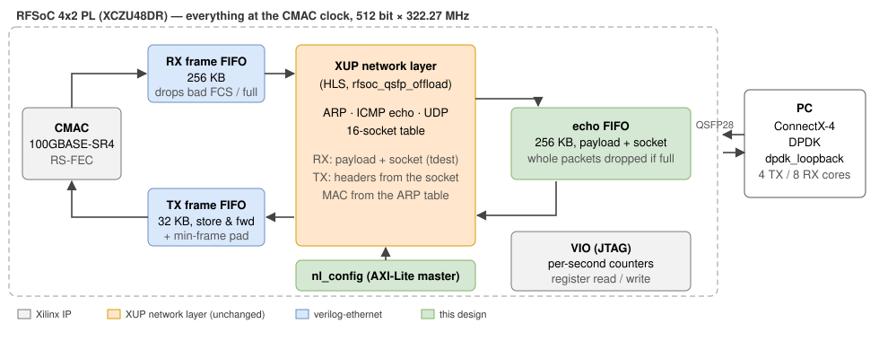
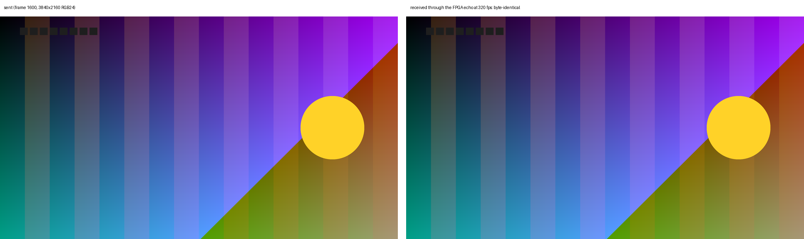

   

[English](#en) | [中文](#cn)

　

RFSoC 4x2 QSFP28 Data Offload and 100G UDP Echo
===========================

Fork of [strath-sdr/rfsoc_qsfp_offload](https://github.com/strath-sdr/rfsoc_qsfp_offload) (University of Strathclyde). The upstream design packs RF-ADC samples into UDP packets with the open-source XUP [Network Layer](https://github.com/Xilinx/xup_vitis_network_example) and sends them out of the RFSoC 4x2 QSFP28 port through the CMAC, as a PYNQ overlay.

This fork adds **[qsfp_udp_echo](./boards/RFSoC4x2/qsfp_udp_echo/README.md)**: the same network layer, unchanged, as a PL-only 100GbE UDP echo (no PYNQ image, configured over JTAG). Result: **4K video (3840x2160 RGB24) at 400 fps = 79.77 Gbit/s each way, 4000/4000 frames byte-exact** with DPDK on the host, no drop at any stage of the FPGA.

　

|  |
| :-------------------------------------------------------------: |
| **Figure1** : 100G UDP echo on the network layer                |

|  |
| :------------------------------------------------------------------: |
| **Figure2** : a sent 4K frame and its echo at 320 fps (identical)    |

　

## 100G UDP Echo (this fork)

* **512 bit × 322.27 MHz end to end**: the network layer runs on the CMAC TX clock, a 100G line never saturates it.
* **Echo without a processor**: received payload + socket (`tdest`) → echo FIFO → network layer, which rebuilds the Ethernet/IP/UDP headers.
* **`nl_config`** writes MAC, IP and 16 sockets after reset and runs ARP discovery; VIO gives per-stage counters and register access.

| Frame rate | Gbit/s each way | Frames intact   | Packets lost |
| :--------: | :-------------: | :-------------: | :----------: |
| 4K120      | 23.93           | 1200 / 1200     | 0            |
| 4K320      | 63.81           | 3200 / 3200     | 0            |
| **4K400**  | **79.77**       | **4000 / 4000** | **0**        |

Build, host setup (DPDK 24.11, ConnectX-4), VIO probes: [boards/RFSoC4x2/qsfp_udp_echo](./boards/RFSoC4x2/qsfp_udp_echo/README.md).

　

## Upstream Data Offload (PYNQ)

|  |
| :--------------------------------------------------------------------------------------: |
| **Figure3** : upstream RF-ADC → UDP → QSFP28 offload (University of Strathclyde)          |

* Hardware: RFSoC 4x2, Mellanox MCX515A-CCAT (PCIe 3.0 x16), 2x QSFP28 100G transceivers + MTP-12 fibre.
* Board: PYNQ v3.0.1, `pip3 install git+https://github.com/strath-sdr/rfsoc_qsfp_offload`, notebooks in `rfsoc-offload`.
* Project files: Vivado / Vitis 2022.1; `git clone --recursive`, then `make patch` (once) and `make all` (network layer IP, bitstream, HWH).
* PC: static IP and MTU 9000 on the QSFP interface; GNU Radio receiver in [gnuradio/README.md](gnuradio/README.md).

|  |
| :------------------------------------------: |
| **Figure4** : upstream GNU Radio receiver    |

　

## License

BSD 3-Clause. Upstream design: Copyright (c) University of Strathclyde (see [LICENSE](LICENSE)). `boards/RFSoC4x2/qsfp_udp_echo`: Copyright (c) 2026, Yijie Yu. Network layer: Xilinx / HPCN-UAM, BSD 3-Clause; verilog-ethernet (submodule): MIT.

　

　

RFSoC 4x2 QSFP28 数据卸载与 100G UDP 回环
===========================

Fork 自 [strath-sdr/rfsoc_qsfp_offload](https://github.com/strath-sdr/rfsoc_qsfp_offload)（University of Strathclyde）。原设计是一个 PYNQ overlay：用开源 XUP [Network Layer](https://github.com/Xilinx/xup_vitis_network_example) 把 RF-ADC 采样打包成 UDP，经 CMAC 从 RFSoC 4x2 的 QSFP28 口发出。

本 fork 新增 **[qsfp_udp_echo](./boards/RFSoC4x2/qsfp_udp_echo/README.md)**：网络层原样保留，做成纯 PL 的 100GbE UDP 回环（无需 PYNQ 镜像，JTAG 配置）。结果：主机用 DPDK，**4K 视频（3840x2160 RGB24）400 fps = 单向 79.77 Gbit/s，4000/4000 帧逐字节一致**，FPGA 各级均无丢包。

　

|  |
| :-------------------------------------------------------------: |
| **图1** : 基于网络层的 100G UDP 回环                            |

|  |
| :------------------------------------------------------------------: |
| **图2** : 发送的一帧 4K 画面与 320 fps 下的回环（完全一致）          |

　

## 100G UDP 回环（本 fork）

* **全程 512 bit × 322.27 MHz**：网络层运行在 CMAC TX 时钟上，100G 线速下不会饱和。
* **无处理器回环**：收到的负载 + socket（`tdest`）→ 回环 FIFO → 网络层，由网络层重建以太网/IP/UDP 头。
* **`nl_config`** 复位后写入 MAC、IP 和 16 个 socket 并做 ARP 发现；VIO 提供各级计数和寄存器读写。

| 帧率      | 单向 Gbit/s | 完整帧          | 丢包  |
| :-------: | :---------: | :-------------: | :---: |
| 4K120     | 23.93       | 1200 / 1200     | 0     |
| 4K320     | 63.81       | 3200 / 3200     | 0     |
| **4K400** | **79.77**   | **4000 / 4000** | **0** |

编译、主机配置（DPDK 24.11，ConnectX-4）、VIO 探针见 [boards/RFSoC4x2/qsfp_udp_echo](./boards/RFSoC4x2/qsfp_udp_echo/README.md)。

　

## 原设计：数据卸载（PYNQ）

|  |
| :--------------------------------------------------------------------------------------: |
| **图3** : 原设计 RF-ADC → UDP → QSFP28 卸载（University of Strathclyde）                  |

* 硬件：RFSoC 4x2，Mellanox MCX515A-CCAT（PCIe 3.0 x16），2 个 QSFP28 100G 光模块 + MTP-12 光纤。
* 板卡：PYNQ v3.0.1，`pip3 install git+https://github.com/strath-sdr/rfsoc_qsfp_offload`，notebook 在 `rfsoc-offload` 目录。
* 工程文件：Vivado / Vitis 2022.1；`git clone --recursive` 后执行 `make patch`（一次）和 `make all`（网络层 IP、bitstream、HWH）。
* PC：QSFP 网口设静态 IP、MTU 9000；GNU Radio 接收见 [gnuradio/README.md](gnuradio/README.md)。

|  |
| :------------------------------------------: |
| **图4** : 原设计的 GNU Radio 接收端          |

　

## 许可证

BSD 3-Clause。原设计版权归 University of Strathclyde（见 [LICENSE](LICENSE)）；`boards/RFSoC4x2/qsfp_udp_echo` 版权所有 (c) 2026 Yijie Yu。网络层（Xilinx / HPCN-UAM）为 BSD 3-Clause；verilog-ethernet（子模块）为 MIT。
